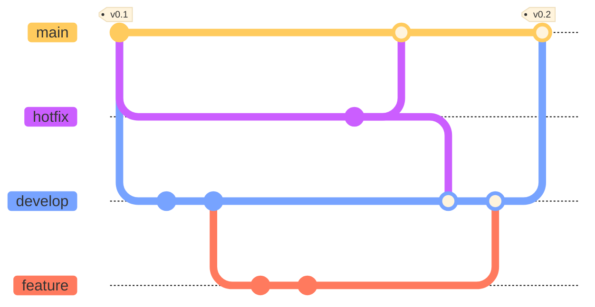

# GUI database

Description

## Table of content
- [Project Structure](#structure)
- [How to init](#init)
- [File documentation template](#documentation)
- [Workflow Branches](#workflow)

## Project Structure 
<pre>
project
├─ 02_tables                // Table creation queries
│  └─ ...
│
├─ 03_views                 // View creation queries
│  └─ ...
│
├─ 04_functions             // Function creation queries
│  └─ ...
│
├─ 05_procedures            // Procedure creation queries
│  └─ ...
│
├─ 09_materialized_views    // Materialized view creation queries
│  └─ ...
│
├─ 01_types.sql             //
├─ 06_index.sql             // Queries for creating indexes
├─ 07_inserts.sql           // Initial insert queries
├─ 08_up-trigger.sql        // Queries for triggers creation
├─ README.md                // This file. Project description
├─ down.sql                 // Delete queries for database objects
└─ init.sh                  // Script for consolidation of database codes
</pre>

## How to init 

To initialize the database run `./init.sh -i` for the creation of files that consolidate the files of the folders that need to be executed in the database.

> **CAUTION:** After execution, use `./init.sh -d` to delete the created files.
>
 

## Workflow Branches 

 

- **main**: Contains the latest stable version. It should not be developed on it.
- **hotfix**: Is ​​created for the resolution of an incident. It must be generated from Master. Once it is developed, the hotfix branch can be merged with main and develop, and finally the branch is deleted.
- **develop**: This branch contains the new functionalities of the application. It is not advisable to commit directly on it, except for small changes that do not affect the logic.
- **feature**: Branch generated from the develop branch. On it, the development of new functionalities will be made. Once the functionality is developed, the feature branch can be merged with develop, and finally the branch is deleted.

To create a new branch from `develop` with this nomenclature `feature/<short_description>` and from `main` with this nomenclature `hotfix/<short_description>` When the new feature or changes is ready, create a merge request and set @cristian.chavez1 as Reviewer
